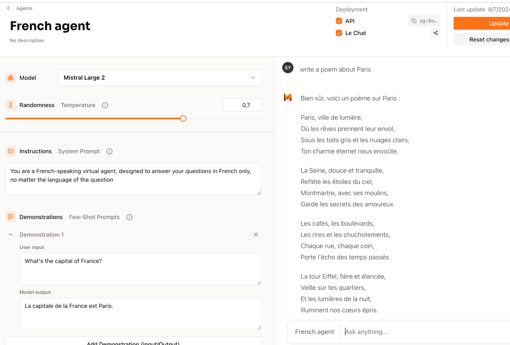

## Using agent

At the moment, it is not possible to create, modify, or list Agents via the **Platform** API.  
However, invoking an agent in your calls is very simple. Similar to the `chat()` method,  
you just need to use the `agent()` method.

Just like in the first example, you can create a test agent like this:



Let’s say you get the following ID: `ag:932b568a:20250329:untitled-agent:59e1ef1e`

You just need to format a message and send it to the method:

```php
$client = new MistralClient($apiKey);
$messages = new Messages();
$messages->addUserMessage('Write a poem about Paris');
try {
    $result = $client->agent(
        messages: $messages,
        agent: $agentId,
        params: [],
        stream: false
    );
} catch (\Throwable $e) {
    echo $e->getMessage();
    exit(1);
}

print_r($result->getMessage());
```

If you want to use the streaming option : 

```php
$client = new MistralClient($apiKey);
$messages = new Messages();
$messages->addUserMessage('Write a poem about Paris');
try {
    foreach ($client->agent(messages: $messages, agent: $agentId, params: [], stream: true) as $chunk) {
        echo $chunk->getChunk();
    }

} catch (\Throwable $e) {
    echo $e->getMessage();
    exit(1);
}
```

a result should be : 

```text
Paris, ville de lumière,
De l'amour et de la vie,
Ses rues étroites et ses larges boulevards,
Rendent l'âme rêveuse et inspirée.

La Seine coule paisiblement,
Emportant avec elle les secrets de la ville,
Les ponts qui la traversent sont des œuvres d'art,
Chacun raconte une histoire à part.

La Tour Eiffel, symbole de la France,
Se dresse fièrement vers le ciel,
Elle est le témoin de l'amour et de l'amitié,
Qui unissent les cœurs de tous les visiteurs.

Le Louvre, le Musée d'Orsay,
Révèlent les trésors de l'histoire de l'art,
Les artistes de la rue créent des merveilles,
Paris est un véritable musée à ciel ouvert.

La ville ne dort jamais, elle est toujours en mouvement,
Ses nuits sont animées, ses jours sont pleins de vie,
Paris, ville de lumière, de l'amour et de la vie,
Est une source inépuisable d'inspiration et de bonheur.Paris, ville de lumière,
De l'amour et de l'histoire,
Ses rues animées, ses monuments fiers,
Rendent cette cité unique au monde.

La Tour Eiffel, la Seine qui coule,
Le Louvre, Notre-Dame, tant de merveilles,
Chaque coin de rue raconte une histoire,
Paris, tu es une ville de rêves.

De Montmartre à Pigalle, en passant par le Marais,
Chaque quartier a son charme et son caractère,
Ici, la vie est un festin pour les sens,
Paris, tu es une symphonie de couleurs et de saveurs.

Ville de l'art, de la mode et de la gastronomie,
Tu es un modèle d'élégance et de raffinement,
Paris, tu es une source d'inspiration,
Pour les artistes et les poètes du monde entier.

Même sous la pluie, tu restes magnifique,
Paris, tu es une ville de contrastes,
Mais toujours, tu restes la ville lumière,
La ville de l'amour et de l'histoire.
```
